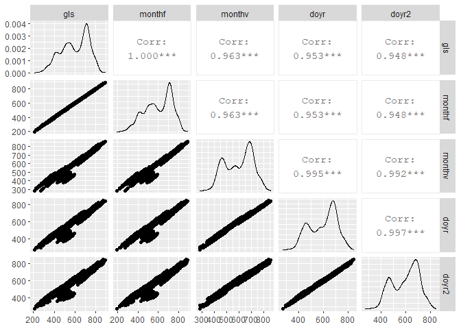
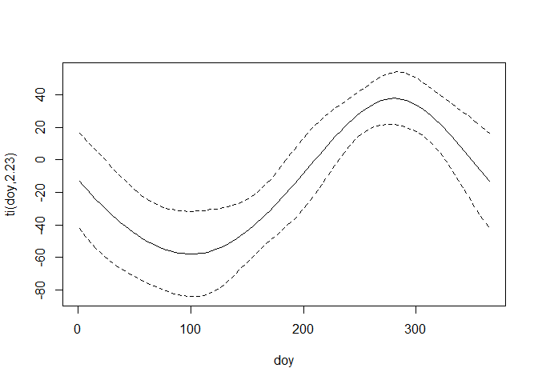
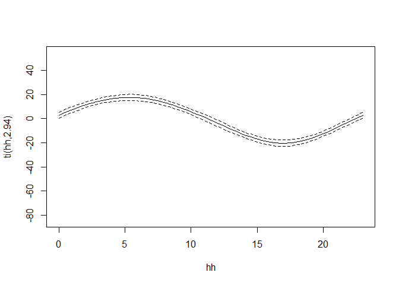
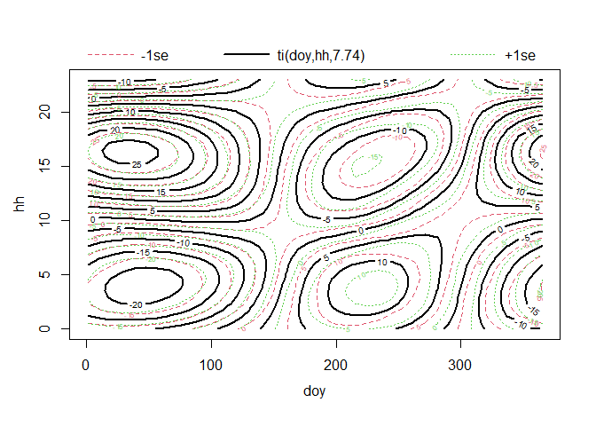

Model Comparisons
================
Curtis C. Bohlen, Casco Bay Estuary Partnership
September 2, 2020

  - [Introduction](#introduction)
  - [Load Libraries](#load-libraries)
  - [Load model results](#load-model-results)
  - [Compare Predictions](#compare-predictions)
  - [ANOVA Comparisons](#anova-comparisons)
  - [GAMM Fitting DOY and Hour, with
    “Interaction”](#gamm-fitting-doy-and-hour-with-interaction)
      - [Structure of Smoothing Terms](#structure-of-smoothing-terms)
  - [Implications for Strength of Linear Association with
    Predictors](#implications-for-strength-of-linear-association-with-predictors)
  - [Preliminary Conclusions](#preliminary-conclusions)
  - [Additional Analyses](#additional-analyses)
  - [Final Comment](#final-comment)


# Introduction

Because GAM models are large, I ran them in a separate Notebook, and
saved them. Here I compare models, especially to gain insight into data
analysis choices and their potential impact.

# Load Libraries

``` r
library(tidyverse)
```

    ## -- Attaching packages -------------------------------------------------------------------------------------- tidyverse 1.3.0 --

    ## v ggplot2 3.3.2     v purrr   0.3.4
    ## v tibble  3.0.3     v dplyr   1.0.0
    ## v tidyr   1.1.0     v stringr 1.4.0
    ## v readr   1.3.1     v forcats 0.5.0

    ## -- Conflicts ----------------------------------------------------------------------------------------- tidyverse_conflicts() --
    ## x dplyr::filter() masks stats::filter()
    ## x dplyr::lag()    masks stats::lag()

``` r
library(mgcv)
```

    ## Loading required package: nlme

    ## 
    ## Attaching package: 'nlme'

    ## The following object is masked from 'package:dplyr':
    ## 
    ##     collapse

    ## This is mgcv 1.8-31. For overview type 'help("mgcv-package")'.

``` r
library(GGally)
```

    ## Registered S3 method overwritten by 'GGally':
    ##   method from   
    ##   +.gg   ggplot2

``` r
library(CBEPgraphics)
```

# Load model results

``` r
the_gls  <- readRDS('results/GLS.rds')
monthf   <- readRDS('results/GAM1.rds')
monthv   <- readRDS('results/GAM1.mm.rds')
doyr     <- readRDS('results/GAM1.doy.1.rds')
doyr2    <- readRDS('results/GAM1.doy.2.rds')
```

# Compare Predictions

Here we look at correlations among model results. This is not normal
statistical practice, but since our goal is to understand which
predictors are most important, it’s worth evaluating how likely it is
that different models would provide substantively different results.
Perhaps it should not be surprising that the models that are
structurally similar give similar predictions.

``` r
preds <- tibble(
         gls    = predict(the_gls),
         monthf = predict(monthf$gam),
         monthv = predict(monthv$gam),
         doyr   = predict(doyr$gam),
         doyr2  = predict(doyr2$gam))

sum(!is.na(preds$monthf))
```

    ## [1] 14761

``` r
ggpairs(preds, progress=FALSE)
```

    ## Warning: Removed 2691 rows containing non-finite values (stat_density).

    ## Warning in ggally_statistic(data = data, mapping = mapping, na.rm = na.rm, :
    ## Removed 2691 rows containing missing values
    
    ## Warning in ggally_statistic(data = data, mapping = mapping, na.rm = na.rm, :
    ## Removed 2691 rows containing missing values
    
    ## Warning in ggally_statistic(data = data, mapping = mapping, na.rm = na.rm, :
    ## Removed 2691 rows containing missing values
    
    ## Warning in ggally_statistic(data = data, mapping = mapping, na.rm = na.rm, :
    ## Removed 2691 rows containing missing values

    ## Warning: Removed 2691 rows containing missing values (geom_point).

    ## Warning: Removed 2691 rows containing non-finite values (stat_density).

    ## Warning in ggally_statistic(data = data, mapping = mapping, na.rm = na.rm, :
    ## Removed 2691 rows containing missing values
    
    ## Warning in ggally_statistic(data = data, mapping = mapping, na.rm = na.rm, :
    ## Removed 2691 rows containing missing values
    
    ## Warning in ggally_statistic(data = data, mapping = mapping, na.rm = na.rm, :
    ## Removed 2691 rows containing missing values

    ## Warning: Removed 2691 rows containing missing values (geom_point).
    
    ## Warning: Removed 2691 rows containing missing values (geom_point).

    ## Warning: Removed 2691 rows containing non-finite values (stat_density).

    ## Warning in ggally_statistic(data = data, mapping = mapping, na.rm = na.rm, :
    ## Removed 2691 rows containing missing values
    
    ## Warning in ggally_statistic(data = data, mapping = mapping, na.rm = na.rm, :
    ## Removed 2691 rows containing missing values

    ## Warning: Removed 2691 rows containing missing values (geom_point).
    
    ## Warning: Removed 2691 rows containing missing values (geom_point).
    
    ## Warning: Removed 2691 rows containing missing values (geom_point).

    ## Warning: Removed 2691 rows containing non-finite values (stat_density).

    ## Warning in ggally_statistic(data = data, mapping = mapping, na.rm = na.rm, :
    ## Removed 2691 rows containing missing values

    ## Warning: Removed 2691 rows containing missing values (geom_point).
    
    ## Warning: Removed 2691 rows containing missing values (geom_point).
    
    ## Warning: Removed 2691 rows containing missing values (geom_point).
    
    ## Warning: Removed 2691 rows containing missing values (geom_point).

    ## Warning: Removed 2691 rows containing non-finite values (stat_density).

<!-- -->
Note also the bimodal structure to the marginal distributions of the
predictions. That may reflect the overabundance of data from certain
times of year, but is probably the consequence of looking at the
marginal distribution of a nearly sinusoidal periodic signals.

# ANOVA Comparisons

To compare the model fits, we need to look at information criteria.
Those statistics are generated by the LME object.

``` r
anova(doyr$lme,  monthv$lme,  doyr2$lme, monthf$lme)
```

    ##            Model df      AIC      BIC    logLik   Test   L.Ratio p-value
    ## doyr$lme       1  8 140656.0 140716.8 -70320.00                         
    ## monthv$lme     2  8 140649.4 140710.2 -70316.69                         
    ## doyr2$lme      3 10 140550.5 140626.5 -70265.27 2 vs 3 102.83743  <.0001
    ## monthf$lme     4 18 140534.0 140670.8 -70249.02 3 vs 4  32.48992   1e-04

By AIC, the best model is the one that fits a separate estimated mean
for each month. BIC, which penalizes model complexity (here, number of
parameters) a bit more, selects the two dimensional smooth, which also
has the highest log likelihood.

I do not want to use the month by month fit, despite its goodperformance
by AIC. That model is less informative about pattern than the full two
dimensional GAM smooth model. Besides, it disturbs me on theoretical
grounds.

Why would the (essentially arbitrary) division between months matter? By
symmetry, it is possible that ANY division of the year into thirty day
(or shorter) time segments would also generate a “good” fit. If that is
the case, the month to month parameters are essentially fitting as
signal a portion of the autocorrelation. I am not convinced that is
wise.

# GAMM Fitting DOY and Hour, with “Interaction”

## Structure of Smoothing Terms

``` r
plot(doyr2$gam)
```

<!-- --><!-- --><!-- -->
The two dimensional smoother here is difficult to interpret. The tensor
smoothers used in this model allow partitioning of the variation in a
manner akin to interaction terms in a linear model. So the two
dimensional fit is a further adjustment AFTER fitting the main effects.
This third term here is highly statistically significant, for what
that’s worth.

What it shows is a relative flattening of the diurnal fluctuations in
the spring, and relative increase in magnitude of diurnal fluctuations
in the fall. That’s nice, because that pattern is clearly visible in the
data. (Also, see the seasonal graphics produced for the State of the
Bay)

# Implications for Strength of Linear Association with Predictors

``` r
summary(doyr2$gam)
```

    ## Warning in as.numeric(object$y) - object$fitted.values: longer object length is
    ## not a multiple of shorter object length

    ## Warning in w * (as.numeric(object$y) - object$fitted.values): longer object
    ## length is not a multiple of shorter object length

    ## 
    ## Family: gaussian 
    ## Link function: identity 
    ## 
    ## Formula:
    ## co2 ~ ti(doy, bs = "cc", k = 5) + ti(hh, bs = "cc", k = 5) + 
    ##     ti(doy, hh, bs = "cc", k = 5) + temp + sal + do
    ## 
    ## Parametric coefficients:
    ##             Estimate Std. Error t value Pr(>|t|)    
    ## (Intercept) 589.1743    18.0222  32.692  < 2e-16 ***
    ## temp          3.9276     0.5784   6.791 1.16e-11 ***
    ## sal          11.2444     0.3309  33.977  < 2e-16 ***
    ## do          -34.0529     0.8918 -38.184  < 2e-16 ***
    ## ---
    ## Signif. codes:  0 '***' 0.001 '**' 0.01 '*' 0.05 '.' 0.1 ' ' 1
    ## 
    ## Approximate significance of smooth terms:
    ##              edf Ref.df     F  p-value    
    ## ti(doy)    2.227      3 10.21 4.97e-08 ***
    ## ti(hh)     2.935      3 88.99  < 2e-16 ***
    ## ti(doy,hh) 7.741      9 14.50  < 2e-16 ***
    ## ---
    ## Signif. codes:  0 '***' 0.001 '**' 0.01 '*' 0.05 '.' 0.1 ' ' 1
    ## 
    ## R-sq.(adj) =     NA   
    ##   Scale est. = 12507     n = 14761

# Preliminary Conclusions

Linear temperature, salinity, and dissolved oxygen terms in this model
are all highly statistically significant on their own (at least by the
implicit “t” test).

  - Temperature varies roughly over a range of thirty degrees C in these
    data. A rise in temperature is associated with a modest increase in
    pCO<sub>2</sub>, as expected even only on thermodynamic grounds. The
    temperature relationship alone suggests a roughly
    \(120 \mu \textrm Atm\) change from coldest to warmest conditions.
    In a separate analysis, we developed GAMM models looking at
    temperature corrected pCO<sub>2</sub> values, and the temperature
    signal remains. More than just thermodynamics is at work here,
    probably system metabolism.

  - Salinity shows much less variation in these data, typically staying
    within the range of roughly 25 to 30. As salinity goes up, so, too
    does pCO<sub>2</sub>. It is not clear why that should be is true. We
    have come up with various hand waving arguments, but none are
    convincing.

  - The negative relationship between dissolved oxygen and
    PCO<sub>2</sub> is striking and strong. Dissolved oxygen at this
    site does not vary much, so a strong negative relationship suggests
    a close physical relationship. That relationship is evident in
    graphic displays as well. A negative correlation is expected due to
    stoichiometry if much of the variation in dissolved gasses is driven
    by system metabolism. On a system level, photosynthesis and
    decomposition are converting CO<sub>2</sub> to O<sub>2</sub> and
    back again. While we did not pull this apart in this preliminary
    analysis, the close relationship breaks down somewhat in winter,
    which again one might expect since biological activity is lower when
    the waters are very cold.

# Additional Analyses

Elsewhere, I have explored more complex models, by extending the GAMM
framework to incorporate alternate model specifications, including:

  - Interaction terms between the three linear predictors  
  - non-linear (spline) alternatives to the linear terms used here; and
  - Multi-dimensional (tensor product) smoothing terms.

The general conclusion has been that the linear terms are inadequate to
capture the structure in these data. Relationships are (slightly)
non-linear; relationships vary seasonally; and interactions between
predictors are often important.

# Final Comment

One hope of these analyses was to come up with some simple metrics to
capture major patterns of estuarine carbonate chemistry. Instead, we
have uncovered tremendous complexity. Relationships between dependent
and independent variables apparently depend crucially on context,
especially location, time of day time of year, and time of tide. It will
prove difficult to identify consistent data analytic techniques that can
be applied at different monitoring locations to identify the impact of
major estuarine processes, like freshwater influx, water column
metabolism, benthic metabolism, upwelling, tidal mixing on local
carbonate chemistry. and
