Time Series Analysis of Uncorrected pCO<sub>2</sub> data
================
Curtis C. Bohlen, Casco Bay Estuary Partnership
September 2, 2020

  - [Introduction](#introduction)
      - [Proposed Models](#proposed-models)
          - [Model 1 and 2](#model-1-and-2)
          - [Model 3](#model-3)
          - [Model 4](#model-4)
          - [Model 5](#model-5)
      - [Proposed Modelling Strategy](#proposed-modelling-strategy)
  - [Load Libraries](#load-libraries)
  - [Load Data](#load-data)
      - [Establish Folder References](#establish-folder-references)
      - [Look Up Data](#look-up-data)
  - [Correcting Time Series](#correcting-time-series)
      - [Check That Timestamps Are
        Consistent](#check-that-timestamps-are-consistent)
      - [Create a Data Frame Containing All Hourly
        Times](#create-a-data-frame-containing-all-hourly-times)
      - [Use left\_join to Merge Data](#use-left_join-to-merge-data)
      - [Delete Unnecessary “blank”
        lines](#delete-unnecessary-blank-lines)
  - [Data Analysis](#data-analysis)
      - [Explore Autocorrelation
        Structure](#explore-autocorrelation-structure)
      - [Formal Models](#formal-models)
          - [Dealing with Large Models and Slow
            Calculations](#dealing-with-large-models-and-slow-calculations)
          - [Intitial GLS](#intitial-gls)
          - [The Equivalent GAMM](#the-equivalent-gamm)
          - [Model of Monthly Seasonality Using Cyclic
            Splines](#model-of-monthly-seasonality-using-cyclic-splines)
          - [Modeling Seasonality by Day of the
            Year](#modeling-seasonality-by-day-of-the-year)
          - [Model with a Two Dimensional Spline
            Fit](#model-with-a-two-dimensional-spline-fit)


# Introduction

This R Notebook looks at preliminary models for analyzing
pCO<sub>2</sub> data from CBEP.

Our principal goal is to determine how best to model time dependence of
PCO<sub>2</sub> values. Once we settle on an approach to modeling time
dependence in GAMS, we will compare results with the results from
methods piloted by EPA.

Because our long-term interest is in comparing “what appears to be most
important” for predicting carbonate chemistry at multiple NEPs, we need
to explore the same model space for all NEPs. We probe alternate model
structures for CBEP as a way to determine whether conclusions are
sensitive to model specification.

Conceptually, the model space we are exploring includes associations
between dependent variables and:

  - Temperature  
  - Salinity  
  - Dissolved Oxygen

But things are more complicated than that suggests.  
1\. Relationships (for any or all of these three predictors) may be
non-linear.  
2\. Interactions between predictors are possible (although their meaning
may not be clear).  
3\. Strong temporal structure (diurnal; seasonal; possibly tidal; serial
autocorrelation) in both dependent and independent variables will
obscure or confound simple relationships.

## Proposed Models

This suggests we need to fit generalized additive models (GAMs), with
autocorrelated errors. There are many possible models that could address
our needs. We fit five different models.

### Model 1 and 2

The models are of the following form:  
1\. Adjust for time of year using a categorical variable.  
2\. Adjust for time of day using a periodic smoothing function.  
3\. Fit the three quantitative predictors as linear terms.  
4\. Include an autoregressive error term of order one.

\[y_{t} = \mu + \mu_{m} +\beta_{1}c_{h}(h) + \beta_{2}T +\beta_{3}S + \beta_{4}D + \gamma  * \epsilon_{t-1} + \epsilon_{t}\]  
Where:  
\* \(y_{t}\) is the dependent time series, here pCO<sub>2</sub>.  
\* \(T\), \(S\), and \(D\), are Temperature, Salinity, and Dissolved
Oxygen.  
\* \(m\) represents the month (of the year).  
\* \(h\) designates the hour of the day.  
\* \(\mu\) is an overall mean.  
\* \(\mu_{m}\) are (eleven) fitted deviations from that mean by month of
the year.  
To avoid an overspecified linear model, R uses January as the reference
level here.  
This set of elelven linear coeficients models seasonality.  
\* \(c_{h}(h)\) is a periodic diurnal smoothing function. This models
diurnal patterns.  
\* \(\beta_{i}\) represent (linear) regression coefficients.  
\* \(\gamma\) represents the correlation with the error of the prior
observation.  
\* \(\epsilon_{t}\) is a sequence of “innovations” or errors.

The difference between the first two models lies the form of the diurnal
smoothing function, which is either constructed from two \(sine\) and
two \(cosine\) terms (fit with \(gls()\)) or fit using a cyclic cubic
spline function through \(gamm()\).

### Model 3

The third model fits a smoothing function for month instead of fitting a
categorical adjustment to the mean for each month.

\[y_{t} = \mu + \beta_{0}c_{m}(m)+\beta_{1}c_{h}(h) + \beta_{2}T +\beta_{3}S + \beta_{4}D + \gamma \epsilon_{t-1} + \epsilon_{t}\]  
Where terms have the same meaning as before and  
\* \(\mu\) is an overall mean.  
\* \(c_{m}(m)\) is a smoothing function for time of year by month.

### Model 4

The fourth model addresses seasonality not on a month by month basis,
but on a day by day basis.

\[y_{t} = \mu + \beta_{0}c_{d}(d)+\ +\beta_{1}c_{h}(h) + \beta_{2}T +\beta_{3}S + \beta_{4}D + \gamma \epsilon_{t-1} + \epsilon_{t}\]  
where  
\* \(d\) indexes the day of the year, also known as the Julian day.  
\* \(c_{d}(d)\) is a seasonal smoothing function.

### Model 5

The final model, fits a two dimensional temporal smoothing function that
in practice allows the diurnal pattern of pCO<sub>2</sub> to vary by
time of year.

\[y_{t} = \mu + \beta_{1}c_{dh}(d,h) + \beta_{2}T +\beta_{3}S + \beta_{4}D + \gamma \epsilon_{t-1} + \epsilon_{t}\]  
where  
\* \(c_{dh}(d,h)\) is a two dimensional smoothing function (cyclic cubic
spline) based on time of day and time of year.

In practice, this final model’s periodic smoothing function will be fit
in three parts, \(C_{d}(d)\), \(C_{h}(h))\), and \(c_{d,h}(d,h)\). That
allows a formal test of whether the two dimensional smoother is
necessary. It is, and with all three terms in the model, it is
equivalent to fitting a single two dimensional smoother.

## Proposed Modelling Strategy

We can begin to fit simplified linear models with GLS, to explore
autocorrelation of errors, and confirm that an corAR1() error structure
is appropriate. We then move on to GAMs.

# Load Libraries

``` r
library(tidyverse)
```

    ## -- Attaching packages -------------------------------------------------------------------------------------- tidyverse 1.3.0 --

    ## v ggplot2 3.3.2     v purrr   0.3.4
    ## v tibble  3.0.3     v dplyr   1.0.0
    ## v tidyr   1.1.0     v stringr 1.4.0
    ## v readr   1.3.1     v forcats 0.5.0

    ## -- Conflicts ----------------------------------------------------------------------------------------- tidyverse_conflicts() --
    ## x dplyr::filter() masks stats::filter()
    ## x dplyr::lag()    masks stats::lag()

``` r
library(readxl)


library(nlme)      # includes gls function
```

    ## 
    ## Attaching package: 'nlme'

    ## The following object is masked from 'package:dplyr':
    ## 
    ##     collapse

``` r
library(mgcv)      # One of two common libraries for general additive models.
```

    ## This is mgcv 1.8-31. For overview type 'help("mgcv-package")'.

``` r
                   # Function gamm allows autocorrelation.
                   # plot allows examination of GAM fit components

# library(CBEPgraphics)
# load_cbep_fonts()
# theme_set(theme_cbep())
```

# Load Data

## Establish Folder References

``` r
sibfldnm <- 'Complete NEP Data'
parent   <- dirname(getwd())
sibling  <- file.path(parent,sibfldnm)

fn    <- 'CB_oa_data.csv'
fpath <- file.path(sibling,fn)
```

## Look Up Data

``` r
the_data <- read_csv(fpath) %>% select(-X1) %>% select(-WaterBody) %>%
  rename_at(vars(contains('_meas')), list(~str_replace(., '_meas','')))  %>%
  rename_all(tolower) %>%
  rename(co2_corr = co2_tcorr12) %>%
  mutate(yyyy = as.numeric(format(datetime, format = '%Y')),
         mm   = as.numeric(format(datetime, format = '%m')),
         dd   = as.numeric(format(datetime, format = '%d')),
         hh   = as.numeric(format(datetime, format = '%H')),
         doy  = as.numeric(format(datetime, format = '%j'))
         )
```

    ## Warning: Missing column names filled in: 'X1' [1]

    ## Parsed with column specification:
    ## cols(
    ##   X1 = col_double(),
    ##   WaterBody = col_character(),
    ##   Season = col_character(),
    ##   DateTime = col_datetime(format = ""),
    ##   Temp_meas = col_double(),
    ##   Sal_meas = col_double(),
    ##   CO2_meas = col_double(),
    ##   DO_meas = col_double(),
    ##   pH_meas = col_double(),
    ##   CO2_Tcorr12 = col_double()
    ## )

# Correcting Time Series

Most modeling functions in R, when applied to time series, assume you
are working with a complete regular time series, and thus do not always
correctly calculate autocorrelations, especially around dates and times
omitted from the data.

(You can, in part get around this with in corAR1() by specifying form=
\~datetime).

Several highly regarded packages, including \(zoo\) and \(xts\) provide
tools to address the same problem, but I have little experience with
them and I have found that they do not always behave as I expect.

So our first step is to rectify our time series. We do this in two
steps. First, we create a “complete” data set, with NAs added as
necessary to fill all time steps. Second, to save space, we toss out any
date or time too far from “real” data to affect our models. Here we plan
only to use lag 1 or perhaps lag 2 models, so we don’t need dates and
times more than one or two steps (hours) away from real data.

## Check That Timestamps Are Consistent

For this to work, all time stamps have to be rounded to the same time
boundaries, here each hour on the hour. We can check that by looking at
the “minute” value form each datetime value.

``` r
range(as.numeric(format(the_data$datetime, format = '%M')), na.rm=TRUE)
```

    ## [1]  0 30

Oh oh…. Some time stamps are on the half hour. All are from late in
2018. We round them down to the next lowest full hour.

``` r
the_data <- the_data %>%
  mutate(datetime = as.POSIXct(paste0(yyyy, '-', mm, '-', dd, ' ', hh, ':00'),
                               format='%Y-%m-%d %H:%M'))
```

## Create a Data Frame Containing All Hourly Times

``` r
firstdt <- min(the_data$datetime, na.rm = TRUE)
lastdt  <- max(the_data$datetime, na.rm = TRUE)
alldt <- tibble(datetime =seq(firstdt, lastdt, "hour"))
range(alldt$datetime)
```

    ## [1] "2015-04-23 11:00:00 EDT" "2018-12-31 23:00:00 EST"

## Use left\_join to Merge Data

This leaves NAs wherever no data lines up witth one of the time stamps.

``` r
full_data <- left_join(alldt, the_data, by='datetime') %>%
  select(-yyyy, -dd, -hh, -doy) %>%
  mutate(yyyy = as.numeric(format(datetime, format = '%Y')),
         mm   = as.numeric(format(datetime, format = '%m')),
         dd   = as.numeric(format(datetime, format = '%d')),
         hh   = as.numeric(format(datetime, format = '%H')),
         doy  = as.numeric(format(datetime, format = '%j'))
         )
rm(alldt, firstdt, lastdt, the_data)
```

## Delete Unnecessary “blank” lines

We want to identify lines to drop. Any datetime line that is more than
two hours away from “real data” can be dropped.

However, we need to recognize that for model comparison, each model must
be fitted to the same data. For legitimate model comparison, all models
must also be built with ML, not REML methods. Once an optimal model is
selected, it could be refit with REML.

``` r
full_data <- full_data %>%
  # First we identify lines that have complete data EITHER for pH or pCO2
  # We need all three predictors and either pH or pCO2.
  mutate(has_data = ! (is.na(temp) | is.na(sal) | is.na(do)) & 
                    ! (is.na(co2)   & is.na(ph))) %>%
  # Then create a shifted version of that data
  # I specify dplyr because dplyr and base lag functions work differently
  mutate(next_has_data = dplyr::lead(has_data),  
         after_has_data = dplyr::lead(has_data,2)) %>%
  filter(has_data | next_has_data | after_has_data) %>%
  select (-has_data, -next_has_data, -after_has_data) %>%
  mutate(Month = factor(mm, levels = 1:12, labels = month.abb) ) %>%
  mutate(Hour = factor (hh, levels = 0:23))
```

# Data Analysis

## Explore Autocorrelation Structure

We can now look at autocorrelation and crosscorrelation structure.
However, these analysis don’t handle seasonal patterns or winter data
gaps correctly. These are preliminary analyses only.

``` r
oldpar <- par(mfrow=c(2,3), mar = c(1,2,3,1))
acf(full_data$temp, main = 'Temp', na.action= na.pass)
acf(full_data$sal, main='Salinity', lag.max=100, na.action= na.pass)
acf(full_data$do, main = 'DO', na.action= na.pass)
acf(full_data$co2, main='CO2', lag.max=100, na.action=na.pass)
acf(full_data$ph, main = 'pH', na.action= na.pass)
par(oldpar)
```

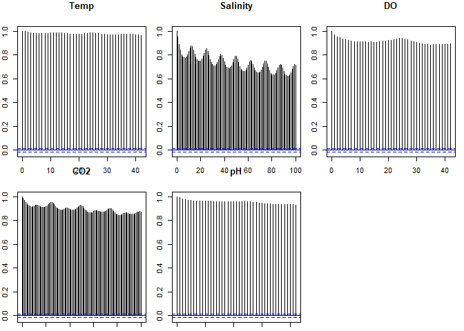<!-- -->

So, autocorrelations are uniformly high, and salinity and CO2 show
strong periodic trends – probably mostly diurnal or tidal.

``` r
oldpar <- par(mfrow=c(2,3), mar = c(1,2,3,1))
pacf(full_data$temp, main = 'Temp', na.action= na.pass)
pacf(full_data$sal, main='Salinity', lag.max=100, na.action= na.pass)
pacf(full_data$do, main = 'DO', na.action= na.pass)
pacf(full_data$co2, main='CO2', lag.max=100, na.action=na.pass)
pacf(full_data$ph, main = 'pH', na.action= na.pass)
par(oldpar)
```

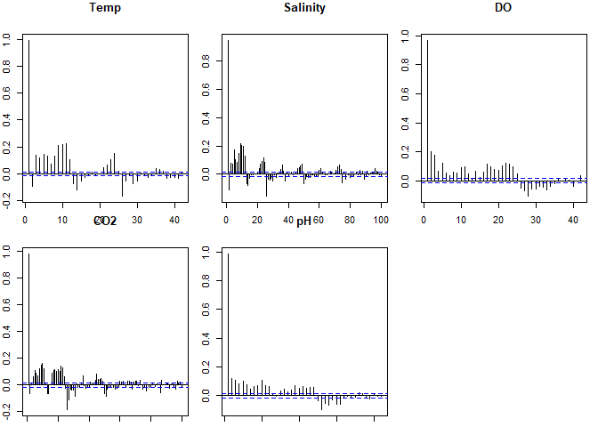<!-- -->

``` r
rm(oldpar)
```

So, a simple autoregressive error function will help, but there is more
structure here. That structure appears to be both diurnal and tidal.

## Formal Models

Here I fit a couple of models using GLS or GAMM functions. These only
fit linear terms relating the predictors to the OA parameters. This is
an over simplification, but a useful starting point for understanding
data structure.

Note here I only fit linear predictors, other than for time of day.

### Dealing with Large Models and Slow Calculations

Many of the models I explored took too much memory and either failed to
run, or took a very long time. The problem appears to be a shortage of
working memory, as it sometimes offered a warning about not being able
to allocate enough memory. This problem was severe on my work computer,
and less so on my home computer, which has many fewer services running
in the background.

I use a number of tricks to reduce the memory footprint of R, but they
are of limited value, presumably because the GLS model I generate are
very large.

The most important step is to start each calculation without other large
objects in memory. In particular, model objects in R usually retain a
full copy of their underlying data, as well as some intermediate data
structures (like variance-covariance matrices) that can also be quite
big.

Here I also fit a more efficient model that fits a periodic function for
time of day. But I STILL ran into memory problems. Presumably, the
problem is that the full data for CBEP is huge. By default, R holds
objects entirely in memory. A lot of searching online failed to find a
ready way to run gls or gamm using tools that swap portions of the data
into and out of working memory (e.g. package ff).

I have also learned that the way you specify the autocorrelation
structure in these models has a large impact on running time.

If these models fail to run, it should be possible to separate the model
into time series and non-time series components, as Nick’s statistician
friend did. But that fits a fundamentally different model, and one that
I have some reservations about because of how it handles co-variation of
dependent and independent variables at different temporal scales.

Finally, I have learned to save the results of these long-running
calculation so I can reload them rather than recalculate them. R
Markdown includes an option to “cache” the results of code blocks. That
is quick and efficient. If you want more control, and can remember to
recalculate results when you change data, code, or data preparation, you
can do it by hand (as here) with save(RDS().

I also save these results here so I can run model comparisons in a
separate R Markdown document without recalculating them. T o keep the
size of the Github repository to reasonable levels, I do not include
model results in the repository.

``` r
full_data <- full_data %>% select(-season, -dd, -Hour)
gc()   # Trigger garbage collection
```

    ##           used  (Mb) gc trigger  (Mb) max used  (Mb)
    ## Ncells 2123929 113.5    4293224 229.3  2693635 143.9
    ## Vcells 3822035  29.2    8388608  64.0  8388606  64.0

### Intitial GLS

Here we fit a (four degree of freedom) sinusoidal relationship for time
of day. This is a fairly straight forward way to include a periodic fit
in a linear model.

In essence, we fit the first few terms of a Taylor series to estimate a
periodic function. We fit both sine and cosine terms because the
(weighted) sum of those terms corresponds to a sine (cosine) function
with arbitrary phase. Fitting both terms allows the phase of the
periodic function to vary, while fitting only linear terms.

It is fairly easy to show that the four periodic functions used here are
orthogonal, which avoids high correlations between terms and helps with
model fitting.

The first pair of sine and cosine functions fits a single wavelength
over a 24 hour period. The second two terms fit two wavelengths over 24
hours. The sum allows the shape to deviate somewhat from a simple
sinusoidal curve. One could continue to add additional sine and cosine
terms at different periods or wavelengths to improve model fit, but it
is really more sensible to just use GAMs, as we do in the next section.

By calling corAR1() with no arguments, or with a form argument of ‘form
= \~ 1’, with or without grouping variables, we are fitting a model that
estimates correlation coefficients between successive observations in
the dataframe, ignoring any time stamps. That is a reasonable approach,
since we inserted NAs at any data gaps so pairs of observations on
either side of a gap in data will not be included in estimation.

Fitting a more formal model by using a form argument, such as ‘form = \~
datetime’ tends to use even more memory. Fitting a model with a grouping
factor, such as ‘form = \~ datetime | yyyy’ or ‘form = \~ 1 | yyyy’
reduces memory demands, and allows most models to run significantly
faster.

Without any grouping factor in the coAR1() call, the following model
took about 15 minutes to run on my home computer, but failed (while
running out of memory) on my work computer. With the grouping variable
(as here), it runs quickly, in under two minutes. By wrapping the gls
function in system.time(), I get a record of how long each model took to
run.

``` r
system.time(the_gls <- gls(co2 ~  Month +
                 sin(((2*pi)/24)*hh) + cos(((2*pi)/24)*hh) +
                 sin(((4*pi)/24)*hh) + cos(((4*pi)/24)*hh) +
                 temp + sal + do,
                 correlation=corAR1(form = ~ 1 | yyyy), data = full_data,
                 na.action = na.exclude, method='ML'))
```

    ##    user  system elapsed 
    ##   57.17   21.14   82.13

``` r
summary(the_gls)
```

    ## Generalized least squares fit by maximum likelihood
    ##   Model: co2 ~ Month + sin(((2 * pi)/24) * hh) + cos(((2 * pi)/24) * hh) +      sin(((4 * pi)/24) * hh) + cos(((4 * pi)/24) * hh) + temp +      sal + do 
    ##   Data: full_data 
    ##        AIC      BIC    logLik
    ##   140495.2 140654.8 -70226.59
    ## 
    ## Correlation Structure: AR(1)
    ##  Formula: ~1 | yyyy 
    ##  Parameter estimate(s):
    ##       Phi 
    ## 0.9594508 
    ## 
    ## Coefficients:
    ##                             Value Std.Error   t-value p-value
    ## (Intercept)              612.6423  33.78631  18.13285  0.0000
    ## MonthFeb                   8.2478  25.54734   0.32284  0.7468
    ## MonthMar                  59.3411  31.82673   1.86450  0.0623
    ## MonthApr                -146.3346  35.46823  -4.12579  0.0000
    ## MonthMay                -125.7379  33.22959  -3.78391  0.0002
    ## MonthJun                 -88.9652  33.24398  -2.67613  0.0075
    ## MonthJul                 -39.6525  33.62613  -1.17922  0.2383
    ## MonthAug                  33.0316  32.94001   1.00278  0.3160
    ## MonthSep                  51.3778  32.67731   1.57228  0.1159
    ## MonthOct                  27.8557  31.96149   0.87154  0.3835
    ## MonthNov                 -19.1451  32.53521  -0.58844  0.5562
    ## MonthDec                 -45.8772  33.41769  -1.37284  0.1698
    ## sin(((2 * pi)/24) * hh)   18.0819   1.15891  15.60250  0.0000
    ## cos(((2 * pi)/24) * hh)    4.4412   1.12857   3.93527  0.0001
    ## sin(((4 * pi)/24) * hh)    4.0131   0.62059   6.46661  0.0000
    ## cos(((4 * pi)/24) * hh)    2.0315   0.61605   3.29759  0.0010
    ## temp                       4.6591   0.56913   8.18644  0.0000
    ## sal                       11.2113   0.33033  33.93989  0.0000
    ## do                       -35.2118   0.89096 -39.52113  0.0000
    ## 
    ##  Correlation: 
    ##                         (Intr) MnthFb MnthMr MnthAp MnthMy MnthJn MnthJl MnthAg
    ## MonthFeb                -0.606                                                 
    ## MonthMar                -0.695  0.709                                          
    ## MonthApr                -0.749  0.579  0.667                                   
    ## MonthMay                -0.796  0.618  0.711  0.879                            
    ## MonthJun                -0.797  0.618  0.711  0.819  0.898                     
    ## MonthJul                -0.784  0.611  0.704  0.791  0.856  0.900              
    ## MonthAug                -0.802  0.624  0.720  0.799  0.859  0.880  0.906       
    ## MonthSep                -0.807  0.631  0.732  0.799  0.858  0.873  0.881  0.931
    ## MonthOct                -0.827  0.649  0.767  0.803  0.862  0.873  0.874  0.906
    ## MonthNov                -0.824  0.634  0.739  0.790  0.846  0.853  0.849  0.874
    ## MonthDec                -0.810  0.616  0.713  0.768  0.822  0.827  0.821  0.841
    ## sin(((2 * pi)/24) * hh) -0.057 -0.028 -0.035 -0.002 -0.007 -0.006 -0.008 -0.005
    ## cos(((2 * pi)/24) * hh) -0.008  0.005  0.013  0.001  0.000  0.000 -0.001  0.000
    ## sin(((4 * pi)/24) * hh)  0.052 -0.024 -0.020 -0.014 -0.020 -0.022 -0.024 -0.024
    ## cos(((4 * pi)/24) * hh)  0.008  0.011  0.015  0.001  0.000  0.000 -0.002 -0.002
    ## temp                    -0.147 -0.002  0.001 -0.103 -0.125 -0.168 -0.199 -0.228
    ## sal                     -0.294  0.004  0.008 -0.019 -0.038 -0.054 -0.072 -0.085
    ## do                      -0.350 -0.010 -0.022  0.013  0.020  0.041  0.050  0.069
    ##                         MnthSp MnthOc MnthNv MnthDc s(((2*p*h c(((2*p*h
    ## MonthFeb                                                               
    ## MonthMar                                                               
    ## MonthApr                                                               
    ## MonthMay                                                               
    ## MonthJun                                                               
    ## MonthJul                                                               
    ## MonthAug                                                               
    ## MonthSep                                                               
    ## MonthOct                 0.932                                         
    ## MonthNov                 0.887  0.922                                  
    ## MonthDec                 0.849  0.868  0.895                           
    ## sin(((2 * pi)/24) * hh) -0.006 -0.003 -0.001 -0.004                    
    ## cos(((2 * pi)/24) * hh) -0.002 -0.006  0.003  0.000  0.040             
    ## sin(((4 * pi)/24) * hh) -0.027 -0.029 -0.032 -0.032 -0.010     0.005   
    ## cos(((4 * pi)/24) * hh) -0.003 -0.006  0.000 -0.002 -0.031     0.002   
    ## temp                    -0.223 -0.195 -0.122 -0.078  0.046    -0.001   
    ## sal                     -0.087 -0.069 -0.037 -0.020  0.033     0.002   
    ## do                       0.080  0.094  0.071  0.063  0.158     0.027   
    ##                         s(((4*p*h c(((4*p*h temp   sal   
    ## MonthFeb                                                 
    ## MonthMar                                                 
    ## MonthApr                                                 
    ## MonthMay                                                 
    ## MonthJun                                                 
    ## MonthJul                                                 
    ## MonthAug                                                 
    ## MonthSep                                                 
    ## MonthOct                                                 
    ## MonthNov                                                 
    ## MonthDec                                                 
    ## sin(((2 * pi)/24) * hh)                                  
    ## cos(((2 * pi)/24) * hh)                                  
    ## sin(((4 * pi)/24) * hh)                                  
    ## cos(((4 * pi)/24) * hh)  0.002                           
    ## temp                    -0.001     0.002                 
    ## sal                     -0.037    -0.018     0.317       
    ## do                      -0.060    -0.008     0.068  0.008
    ## 
    ## Standardized residuals:
    ##        Min         Q1        Med         Q3        Max 
    ## -2.8205771 -0.6521321 -0.1541437  0.4850592  6.9222260 
    ## 
    ## Residual standard error: 99.94122 
    ## Degrees of freedom: 14761 total; 14742 residual

``` r
coef(the_gls)
```

    ##             (Intercept)                MonthFeb                MonthMar 
    ##              612.642273                8.247822               59.341099 
    ##                MonthApr                MonthMay                MonthJun 
    ##             -146.334607             -125.737858              -88.965180 
    ##                MonthJul                MonthAug                MonthSep 
    ##              -39.652455               33.031649               51.377829 
    ##                MonthOct                MonthNov                MonthDec 
    ##               27.855684              -19.145106              -45.877186 
    ## sin(((2 * pi)/24) * hh) cos(((2 * pi)/24) * hh) sin(((4 * pi)/24) * hh) 
    ##               18.081852                4.441233                4.013128 
    ## cos(((4 * pi)/24) * hh)                    temp                     sal 
    ##                2.031480                4.659114               11.211335 
    ##                      do 
    ##              -35.211827

#### Informal Plot of Time of Day

``` r
(terms <- coef(the_gls)[13:16])
```

    ## sin(((2 * pi)/24) * hh) cos(((2 * pi)/24) * hh) sin(((4 * pi)/24) * hh) 
    ##               18.081852                4.441233                4.013128 
    ## cos(((4 * pi)/24) * hh) 
    ##                2.031480

``` r
hh = 1:24
vv =   terms[1] * sin(((2 * pi)/24) * hh) + 
       terms[1] * cos(((2 * pi)/24) * hh) +
       terms[1] * sin(((4 * pi)/24) * hh) +
       terms[1] * cos(((4 * pi)/24) * hh)
plot(hh,vv, type = 'l')
```

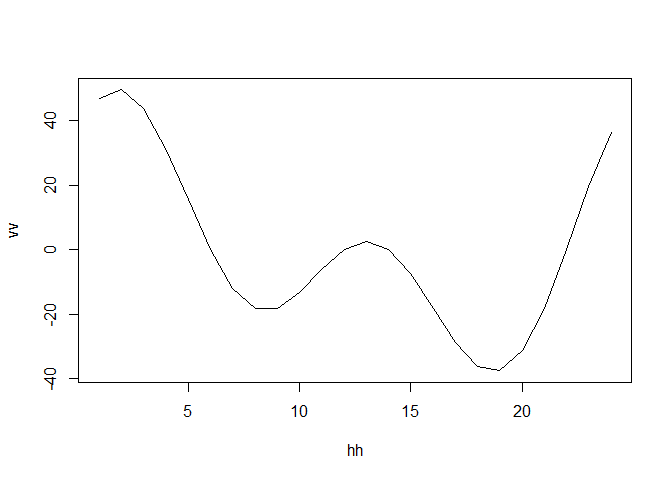<!-- -->

It is not very satisfying to have such a large “lump” in the middle of
the day. That suggests a four term sinusoidal fit is inadequate or that
we have wide (unreported here) error bands around the sinusoidal fit.
Don’t trust this model.

``` r
saveRDS(the_gls, 'results/GLS.rds')
rm(the_gls)
gc()
```

    ##           used  (Mb) gc trigger   (Mb)  max used  (Mb)
    ## Ncells 2135441 114.1    4293224  229.3   2693635 143.9
    ## Vcells 3848044  29.4  151158428 1153.3 129458860 987.7

### The Equivalent GAMM

This took a bit over half an hour on my home computer without the
grouping variable, and again failed on my work computer. With the
grouping variable, it takes anywhere from a bit less than five minutes
to a bit more than ten.

``` r
system.time(the_gam <- gamm(co2 ~  Month +
                 s(hh, bs="cc") +
                 temp + sal + do,
                 correlation=corAR1(form = ~ 1 | yyyy), data = full_data,
                 na.action = na.exclude, method='ML'))
```

    ##    user  system elapsed 
    ##  191.50   38.73  318.68

GAMMs inherit both from LME and from GAM objects. Results of can
therefore be examined both via the underlying LME and the GAM
components. The GAM model output is slightly simpler, but provides less
info on correlation structure, including the estimate of the magnitude
of the AR1 term.

``` r
summary(the_gam$lme)
```

    ## Linear mixed-effects model fit by maximum likelihood
    ##  Data: strip.offset(mf) 
    ##      AIC      BIC    logLik
    ##   140534 140670.8 -70249.02
    ## 
    ## Random effects:
    ##  Formula: ~Xr - 1 | g
    ##  Structure: pdIdnot
    ##              Xr1      Xr2      Xr3      Xr4      Xr5      Xr6      Xr7      Xr8
    ## StdDev: 2.491879 2.491879 2.491879 2.491879 2.491879 2.491879 2.491879 2.491879
    ##         Residual
    ## StdDev: 99.86804
    ## 
    ## Correlation Structure: AR(1)
    ##  Formula: ~1 | g/yyyy 
    ##  Parameter estimate(s):
    ##       Phi 
    ## 0.9593273 
    ## Fixed effects: y ~ X - 1 
    ##                  Value Std.Error    DF   t-value p-value
    ## X(Intercept)  608.8296  33.76693 14746  18.03035  0.0000
    ## XMonthFeb      12.0628  25.55156 14746   0.47210  0.6369
    ## XMonthMar      66.8011  31.81249 14746   2.09984  0.0358
    ## XMonthApr    -146.3231  35.43725 14746  -4.12908  0.0000
    ## XMonthMay    -121.8876  33.19600 14746  -3.67176  0.0002
    ## XMonthJun     -83.8509  33.21169 14746  -2.52474  0.0116
    ## XMonthJul     -34.0571  33.59494 14746  -1.01376  0.3107
    ## XMonthAug      38.2945  32.91069 14746   1.16359  0.2446
    ## XMonthSep      57.5802  32.64871 14746   1.76363  0.0778
    ## XMonthOct      35.0744  31.93312 14746   1.09837  0.2721
    ## XMonthNov     -11.6052  32.50388 14746  -0.35704  0.7211
    ## XMonthDec     -36.5096  33.37810 14746  -1.09382  0.2741
    ## Xtemp           4.5915   0.56936 14746   8.06433  0.0000
    ## Xsal           11.2281   0.33054 14746  33.96881  0.0000
    ## Xdo           -35.3720   0.89143 14746 -39.67999  0.0000
    ##  Correlation: 
    ##           X(Int) XMnthF XMnthMr XMnthAp XMnthMy XMnthJn XMnthJl XMnthAg XMnthS
    ## XMonthFeb -0.606                                                              
    ## XMonthMar -0.695  0.709                                                       
    ## XMonthApr -0.749  0.579  0.667                                                
    ## XMonthMay -0.796  0.618  0.712   0.879                                        
    ## XMonthJun -0.796  0.618  0.711   0.819   0.898                                
    ## XMonthJul -0.784  0.611  0.704   0.791   0.856   0.900                        
    ## XMonthAug -0.801  0.624  0.720   0.799   0.859   0.880   0.906                
    ## XMonthSep -0.807  0.631  0.732   0.799   0.858   0.873   0.881   0.931        
    ## XMonthOct -0.826  0.649  0.767   0.804   0.862   0.873   0.874   0.906   0.931
    ## XMonthNov -0.824  0.634  0.739   0.790   0.846   0.853   0.849   0.874   0.887
    ## XMonthDec -0.810  0.616  0.712   0.769   0.822   0.827   0.821   0.841   0.849
    ## Xtemp     -0.148 -0.001  0.001  -0.103  -0.125  -0.168  -0.199  -0.228  -0.223
    ## Xsal      -0.295  0.004  0.008  -0.019  -0.038  -0.055  -0.072  -0.085  -0.088
    ## Xdo       -0.351 -0.010 -0.021   0.013   0.020   0.041   0.051   0.070   0.080
    ##           XMnthO XMnthN XMnthD Xtemp  Xsal  
    ## XMonthFeb                                   
    ## XMonthMar                                   
    ## XMonthApr                                   
    ## XMonthMay                                   
    ## XMonthJun                                   
    ## XMonthJul                                   
    ## XMonthAug                                   
    ## XMonthSep                                   
    ## XMonthOct                                   
    ## XMonthNov  0.922                            
    ## XMonthDec  0.868  0.895                     
    ## Xtemp     -0.195 -0.122 -0.078              
    ## Xsal      -0.069 -0.037 -0.020  0.317       
    ## Xdo        0.095  0.072  0.064  0.067  0.007
    ## 
    ## Standardized Within-Group Residuals:
    ##        Min         Q1        Med         Q3        Max 
    ## -2.8382143 -0.6544408 -0.1488974  0.4886484  6.9151011 
    ## 
    ## Number of Observations: 14761
    ## Number of Groups: 1

  - The estimated autocorrelation between successive observations is
    0.95\!
  - The month by month estimates are negatively correlated with the
    intercept.
  - In the current model parameterization, the month of January is the
    base case, and thus represented by the intercept, while the “month”
    parameters shown in the LME output are deviations from the
    intercept.
  - This model suggests a moderate seasonal pattern, with lowest
    CO<sub>2</sub> values in late spring, but seasonal differences among
    other months rather subdued.

<!-- end list -->

``` r
summary(the_gam$gam)
```

    ## Warning in as.numeric(object$y) - object$fitted.values: longer object length is
    ## not a multiple of shorter object length

    ## Warning in w * (as.numeric(object$y) - object$fitted.values): longer object
    ## length is not a multiple of shorter object length

    ## 
    ## Family: gaussian 
    ## Link function: identity 
    ## 
    ## Formula:
    ## co2 ~ Month + s(hh, bs = "cc") + temp + sal + do
    ## 
    ## Parametric coefficients:
    ##              Estimate Std. Error t value Pr(>|t|)    
    ## (Intercept)  608.8296    33.7669  18.030  < 2e-16 ***
    ## MonthFeb      12.0628    25.5516   0.472 0.636864    
    ## MonthMar      66.8011    31.8125   2.100 0.035760 *  
    ## MonthApr    -146.3231    35.4373  -4.129 3.66e-05 ***
    ## MonthMay    -121.8876    33.1960  -3.672 0.000242 ***
    ## MonthJun     -83.8509    33.2117  -2.525 0.011589 *  
    ## MonthJul     -34.0571    33.5949  -1.014 0.310716    
    ## MonthAug      38.2945    32.9107   1.164 0.244610    
    ## MonthSep      57.5802    32.6487   1.764 0.077815 .  
    ## MonthOct      35.0744    31.9331   1.098 0.272061    
    ## MonthNov     -11.6052    32.5039  -0.357 0.721067    
    ## MonthDec     -36.5096    33.3781  -1.094 0.274052    
    ## temp           4.5915     0.5694   8.064 7.93e-16 ***
    ## sal           11.2281     0.3305  33.969  < 2e-16 ***
    ## do           -35.3720     0.8914 -39.680  < 2e-16 ***
    ## ---
    ## Signif. codes:  0 '***' 0.001 '**' 0.01 '*' 0.05 '.' 0.1 ' ' 1
    ## 
    ## Approximate significance of smooth terms:
    ##         edf Ref.df     F p-value    
    ## s(hh) 7.227      8 36.23  <2e-16 ***
    ## ---
    ## Signif. codes:  0 '***' 0.001 '**' 0.01 '*' 0.05 '.' 0.1 ' ' 1
    ## 
    ## R-sq.(adj) =     NA   
    ##   Scale est. = 9973.6    n = 14761

One nice feature of these GAMS is that you can visually inspect the
non-linear terms included in the GAM component of the model with a
simple call to plot(). here there is only one non-linear (smoothed) term
, the diurnal pattern of CO<sub>2</sub>.

``` r
plot(the_gam$gam)
```

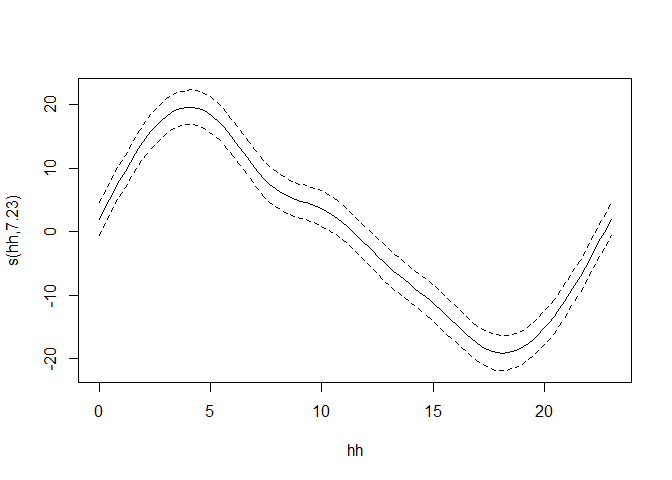<!-- -->

The timestamp used here is in UTC, so it does not correspond to time of
day in Maine. In fact, the time in these data is off by 4 hours from
local standard time and five hours from local daylight savings time.

(For more detail on dealing with time stamps while importing data, see
the analyses of these data prepared for the CBEP State of the Bay
Report. We don’t bother to convert the time units here.)

When it is 4:00 AM at Greenwich, it is midnight in Maine, so those
results suggest our highest pCO2 tends to occur slightly after midnight
(local time) with levels dropping throughout the day, reaching a minimum
in late afternoon.

It’s worth wondering if the residuals of this model retain significant
autocorrelation.

``` r
acf(resid(the_gam$lme), main = 'GLS Residuals', na.action= na.pass)
```

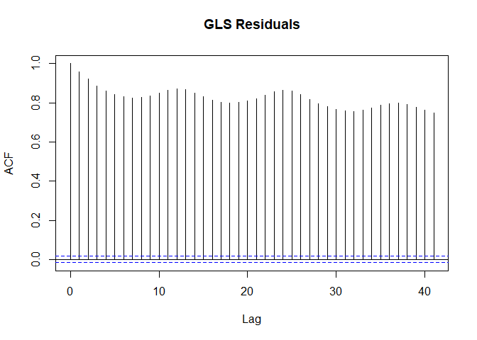<!-- -->

``` r
pacf(resid(the_gam$lme), main = 'GLS Residuals', na.action= na.pass)
```

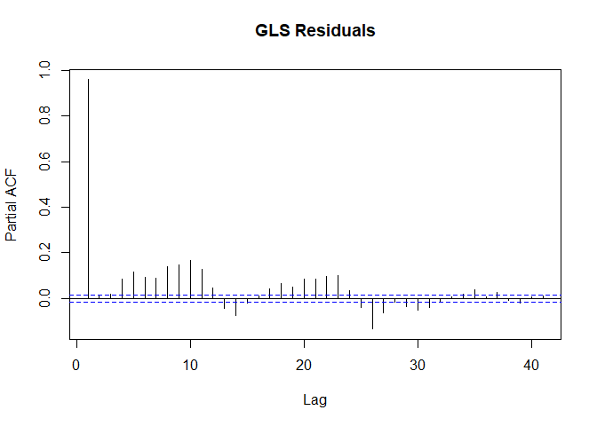<!-- -->
They do. Some periodic structure remains with a roughly 12 or 24 hour
period. That is an indication that we have not yet captured all the
structure in this time series. We should interpret model results with a
certain amount of caution.

The high partial autocorrelation at period 1 is expected, as the model
does not REMOVE the AR1 term. It only accounts for it in model fitting
to provide more accurate estimates of standard errors.

``` r
saveRDS(the_gam, 'results/GAM1.rds')
```

### Model of Monthly Seasonality Using Cyclic Splines

We face an embarrassment of possible model structures as we fit
quasi-periodic structures to both diurnal and seasonal patterns. We can
start to explore some of those possible structures by looking at lower
degree of freedom ways of modeling seasonality. her we fit a periodic
cubic spline function to the month of the year.

This also takes around five minutes to run.

``` r
rm(the_gam)
gc()
```

    ##           used  (Mb) gc trigger   (Mb)  max used   (Mb)
    ## Ncells 2256866 120.6    4293128  229.3   2693671  143.9
    ## Vcells 4182411  32.0  297447512 2269.4 370530428 2827.0

``` r
system.time(the_gam_mm <- gamm(co2 ~  s(mm, bs='cc', k=5) +
                 s(hh, bs="cc", k=5) +
                 temp + sal + do,
                 correlation=corAR1(form = ~ 1 | yyyy), data = full_data,
                 na.action = na.exclude, method='ML'))
```

    ##    user  system elapsed 
    ##  213.28   74.89  300.19

``` r
plot(the_gam_mm$gam)
```

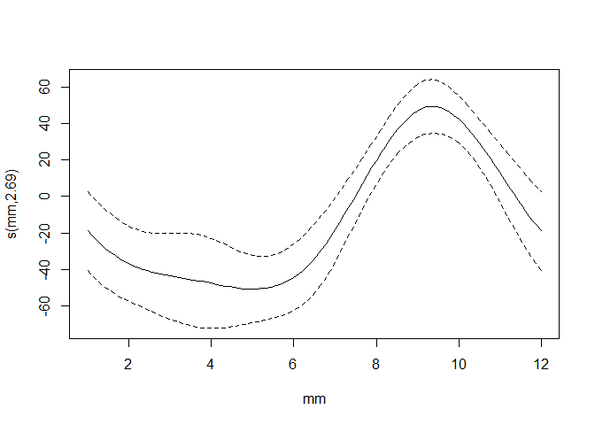<!-- -->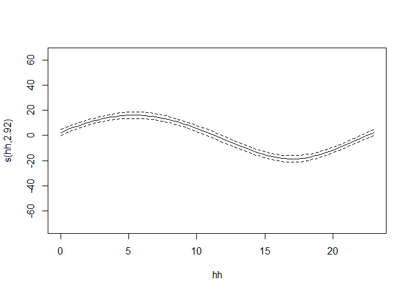<!-- -->
Here we see a strong seasonal pattern, with a weaker smooth, nearly
sinusoidal patterns for time of day. The magnitude of this time of day
term is similar to what wee saw in the other GAMM, and perhaps half as
strong as estimated by the GLS model. The timing of the time of day term
is shifted slightly, but only slightly.

``` r
saveRDS(the_gam_mm, 'results/GAM1.mm.rds')
```

### Modeling Seasonality by Day of the Year

This model took just over five minutes to run.

``` r
rm(the_gam_mm)
gc()
```

    ##           used  (Mb) gc trigger   (Mb)  max used   (Mb)
    ## Ncells 2257058 120.6    4293128  229.3   2693671  143.9
    ## Vcells 4182902  32.0  274268428 2092.6 370530428 2827.0

``` r
system.time(the_gam_doy <- gamm(co2 ~  s(doy, bs="cc", k=5) +
                 s(hh, bs="cc", k=5) +
                 temp + sal + do,
                 correlation=corAR1(form = ~ 1 | yyyy), data = full_data,
                 na.action = na.exclude, method='ML'))
```

    ##    user  system elapsed 
    ##  199.66   68.60  273.94

``` r
plot(the_gam_doy$gam)
```

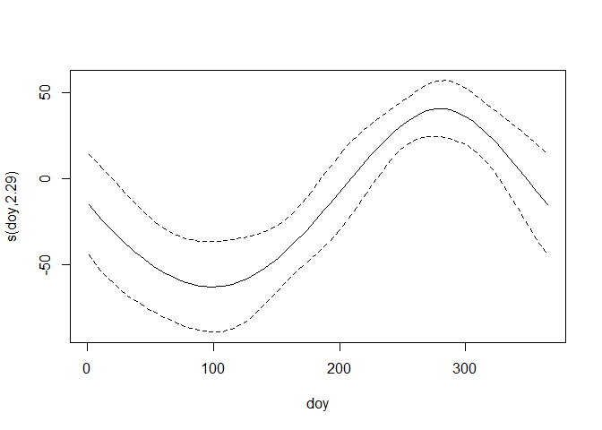<!-- -->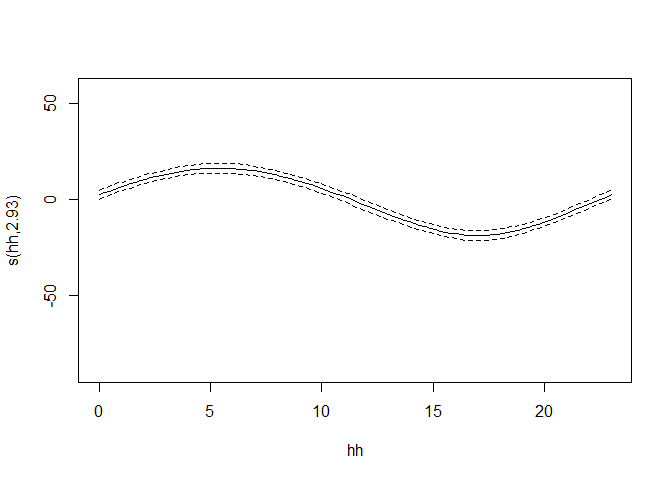<!-- -->

Those terms look remarkably similar to what we saw in the last model.
Looking at the model summaries shows the similarities extend to
estimates of the linear model terms. Functionally, the two models give
similar results.

``` r
saveRDS(the_gam_doy, 'results/GAM1.doy.1.rds')
```

### Model with a Two Dimensional Spline Fit

We can also fit a “joint” model in which time of year and time of day
are fit as a two dimensional smoother. This effectively allows the
effect of time of year to vary by time of year. It is, in effect, the
smoother equivalent to an interaction term in a linear model.

That model can be fit in several ways. One way is to just jump right in
and fit a two dimensional smoother, with s(doy,hh, bs = “cc”, k=5), but
that does not allow assessment of whether the quasi-interaction term is
necessary. The \(ti()\) function is a “tensor product” specifically
designed to allow terms to be decomposed to allow tests of importance of
the joint smooth.

This final model took just over ten minutes to run.

``` r
rm(the_gam_doy)
gc()
```

    ##             used   (Mb) gc trigger   (Mb)  max used   (Mb)
    ## Ncells   2193815  117.2    4292950  229.3   2694097  143.9
    ## Vcells 131338521 1002.1  340670084 2599.2 322554958 2460.9

``` r
system.time(the_gam_doy_2 <- gamm(co2 ~  ti(doy, bs="cc", k=5) + ti(hh, bs="cc", k=5) + ti(doy,hh, bs="cc", k=5) +
                 temp + sal + do,
                 correlation=corAR1(form = ~ 1 | yyyy), data = full_data,
                 na.action = na.exclude, method='ML'))
```

    ##    user  system elapsed 
    ##  475.21  158.15  648.10

``` r
plot(the_gam_doy_2$gam)
```

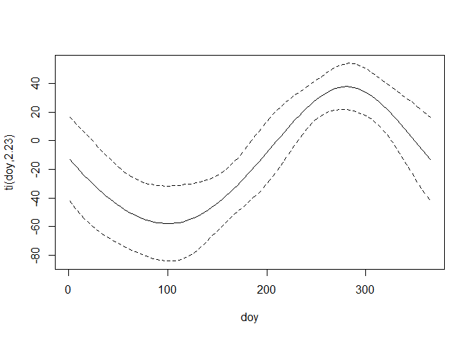<!-- -->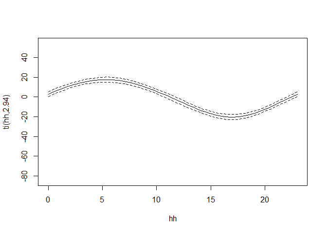<!-- -->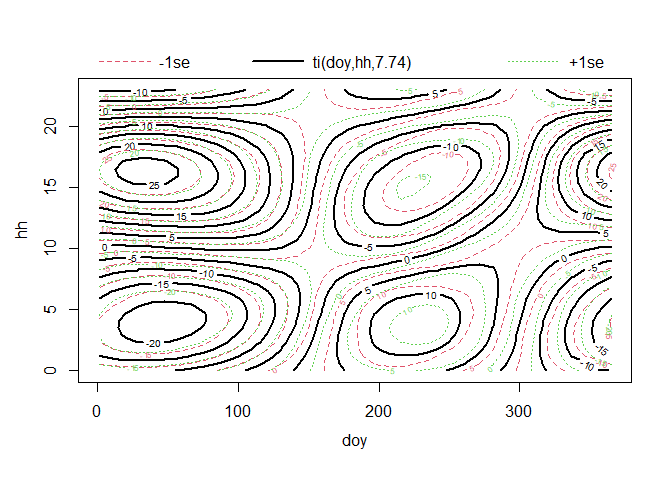<!-- -->

The magnitude of the seasonal pattern has been reduced slightly, as some
of the structure has been absorbed into the joint smooth. The joint
smoothing term (which tests as significant if you look at the model
summaries) shows that the diurnal patterns is weakened during winter,
and strengthened in late summer and fall. However, we have relatively
little winter data, so the strength of this pattern in winter is
probably suspect.

``` r
saveRDS(the_gam_doy_2, 'results/GAM1.doy.2.rds')
```

This analysis continues in a separate R Markdown document “Model
Comparisons pCO2.Rmd”.
