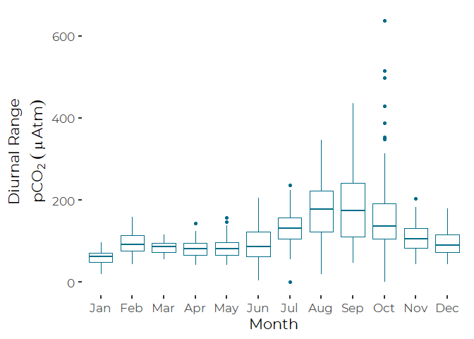
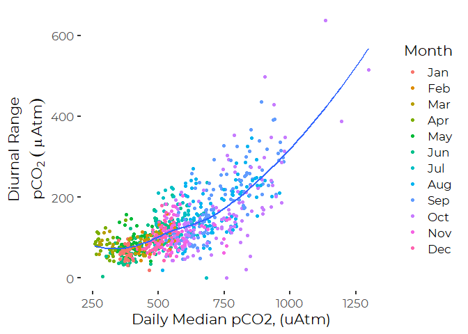
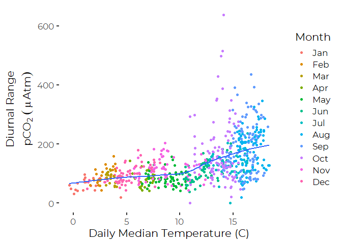
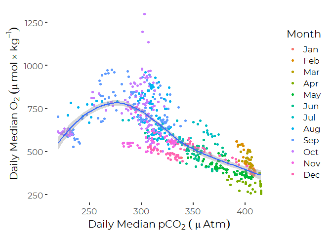

Diurnal Patterns of pCO<sub>2</sub> and pH
================
Curtis C. Bohlen, Casco Bay Estuary Partnership
September 2, 2020

  - [Introduction](#introduction)
  - [Load Libraries](#load-libraries)
  - [Load Data](#load-data)
      - [Establish Folder References](#establish-folder-references)
      - [Look Up Data](#look-up-data)
  - [Summarize Casco Bay Data by
    Days](#summarize-casco-bay-data-by-days)
  - [Preliminary Graphics](#preliminary-graphics)
      - [Boxplot](#boxplot)
      - [Diurnal Range by Median](#diurnal-range-by-median)
      - [Diurnal Range by Temperature and
        Month](#diurnal-range-by-temperature-and-month)
      - [Daily Median CO<sub>2</sub> versus
        Oxygen](#daily-median-co2-versus-oxygen)


# Introduction

This R Notebook develops graphic ideas for looking at pH and
pCO<sub>2</sub> data, using data from CBEP. This is for demonstration
purposes, and to help develop ideas for graphics and statistical
methods.

# Load Libraries

``` r
library(tidyverse)
```

    ## -- Attaching packages -------------------------------------------------------------------------------------- tidyverse 1.3.0 --

    ## v ggplot2 3.3.2     v purrr   0.3.4
    ## v tibble  3.0.3     v dplyr   1.0.0
    ## v tidyr   1.1.0     v stringr 1.4.0
    ## v readr   1.3.1     v forcats 0.5.0

    ## -- Conflicts ----------------------------------------------------------------------------------------- tidyverse_conflicts() --
    ## x dplyr::filter() masks stats::filter()
    ## x dplyr::lag()    masks stats::lag()

``` r
library(readxl)
library(CBEPgraphics)
load_cbep_fonts()
theme_set(theme_cbep())
```

# Load Data

## Establish Folder References

``` r
sibfldnm <- 'Derived Data'
parent   <- dirname(getwd())
sibling  <- file.path(parent,sibfldnm)

fn    <- 'THREE_NEP_OA_Data.csv'
fpath <- file.path(sibling,fn)
```

## Look Up Data

``` r
all_data <- read_csv(fpath) %>% select(-X1)
```

    ## Warning: Missing column names filled in: 'X1' [1]

    ## Parsed with column specification:
    ## cols(
    ##   X1 = col_double(),
    ##   WaterBody = col_character(),
    ##   DateTime = col_datetime(format = ""),
    ##   yyyy = col_double(),
    ##   mm = col_double(),
    ##   dd = col_double(),
    ##   doy = col_double(),
    ##   hh = col_double(),
    ##   Temp = col_double(),
    ##   Salinity = col_double(),
    ##   CO2 = col_double(),
    ##   DO = col_double(),
    ##   pH = col_double()
    ## )

# Summarize Casco Bay Data by Days

The first step is to extract data by the day, so we can look at daily
medians, ranges, IQRs and 90% ranges.

``` r
daily_data <- all_data %>%
  filter(WaterBody == 'CB') %>%
  select(-WaterBody, -hh, -yyyy, -mm, -dd, -doy) %>%
  mutate(the_date = as.Date(DateTime)) %>%
  select(-DateTime) %>%
  group_by(the_date) %>%
  summarise_at(c("Temp", "Salinity", "CO2", "DO", "pH"),
               c(m    = function(x) median(x, na.rm=TRUE),
                 r    = function(x) {suppressWarnings(max(x, na.rm=TRUE) -
                                                        min(x, na.rm=TRUE))},
                iqr  = function(x) IQR(x, na.rm=TRUE),
                p90r = function(x) {as.numeric(quantile(x, 0.95, na.rm=TRUE) -
                       quantile(x, 0.05, na.rm=TRUE))})) %>%
  mutate(yyyy = as.numeric(format(the_date, format = '%Y')),
         mm   = as.numeric(format(the_date, format = '%m')),
         dd   = as.numeric(format(the_date, format = '%d')),
         doy  = as.numeric(format(the_date, format = '%j')),
         Month = factor(mm, levels=1:12, labels = month.abb)
         )
```

# Preliminary Graphics

## Boxplot

``` r
plt <- daily_data %>%
  select_at(vars(contains('CO2'), dd, doy, mm, Month, yyyy)) %>%
  filter(complete.cases(.)) %>%
  ggplot(aes(x=Month)) +
  geom_boxplot(aes(y= CO2_r), col = cbep_colors()[1]) +
  xlab('Month') + 
  ylab(expression(atop("Diurnal Range", pCO[2]~(~mu~Atm))))
plt
```

<!-- -->

## Diurnal Range by Median

``` r
tmp <- daily_data %>%
  select_at(vars(CO2_m,CO2_r, dd, doy, mm, Month, yyyy)) %>%
  rename(Median = CO2_m, Range = CO2_r) %>%
  filter(complete.cases(.))

plt <- ggplot(tmp, aes(x = Median, y=Range)) + geom_point(aes(color = Month)) + 
geom_smooth(se=FALSE) +
    xlab("Daily Median pCO2, (uAtm)") + 
     ylab(expression(atop("Diurnal Range", pCO[2]~(~mu~Atm))))
plt
```

    ## `geom_smooth()` using method = 'loess' and formula 'y ~ x'

<!-- -->

## Diurnal Range by Temperature and Month

``` r
tmp <- daily_data %>%
  select(Temp_m, DO_m, CO2_m, CO2_r, dd, doy, mm, yyyy) %>%
  mutate(Month = factor(mm, levels = 1:12, labels = month.abb)) %>%
  filter(complete.cases(.))

plt <- ggplot(tmp, aes(Temp_m, CO2_r)) +
  geom_point(aes(color = Month)) +
  geom_smooth(se = FALSE) +
  ylab(expression(atop("Diurnal Range", pCO[2]~(~mu~Atm)))) +
  xlab('Daily Median Temperature (C)')
plt
```

    ## `geom_smooth()` using method = 'loess' and formula 'y ~ x'

<!-- -->

## Daily Median CO<sub>2</sub> versus Oxygen

``` r
plt <- ggplot(tmp, aes(DO_m, CO2_m)) +
  geom_point(aes(color = Month)) +
  geom_smooth() +
  xlab(expression("Daily Median" ~ pCO[2]~(~mu~Atm)))  +
  ylab(expression('Daily Median' ~ O[2]~(mu~mol %*% kg^-1)))
plt
```

    ## `geom_smooth()` using method = 'loess' and formula 'y ~ x'

<!-- -->
