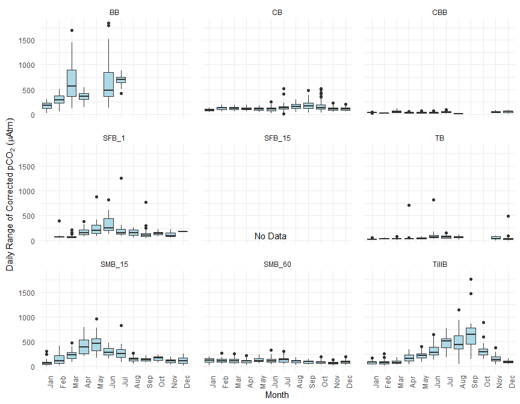
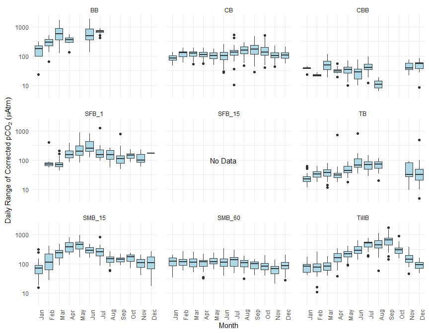
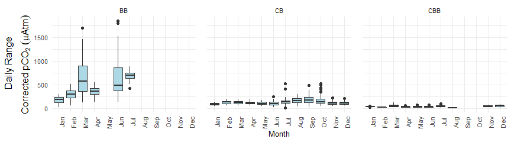
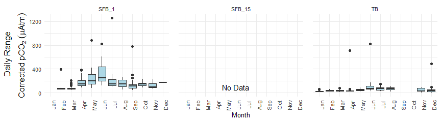
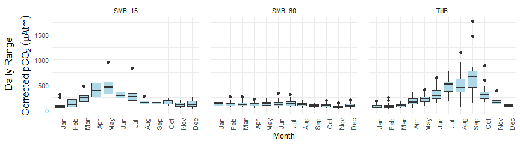
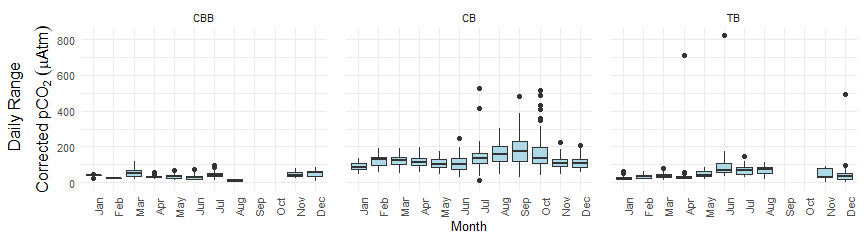
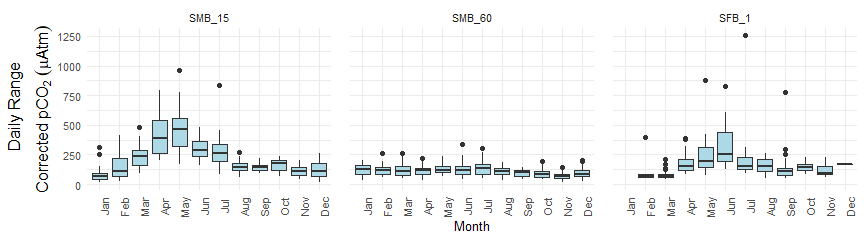
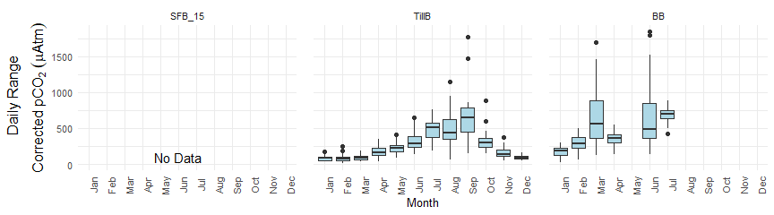

Graphics Showing Magnitude of Diurnal Fluctuation in pCO<sub>2</sub>
from NEPs
================
Curtis C. Bohlen, Casco Bay Estuary Partnership
September 2, 2020

  - [Introduction](#introduction)
  - [Load Libraries](#load-libraries)
  - [Load Data](#load-data)
      - [Establish Folder References](#establish-folder-references)
      - [Look Up Data](#look-up-data)
  - [Summarize Data by Days](#summarize-data-by-days)
  - [Graphic Layout Considerations](#graphic-layout-considerations)
  - [Preliminary Graphic (Temperature Corrected
    pCO<sub>2</sub>)](#preliminary-graphic-temperature-corrected-pco2)
  - [Three Horizontal Panel Layouts](#three-horizontal-panel-layouts)
      - [First Layout](#first-layout)
      - [Alternate Panel Order](#alternate-panel-order)


# Introduction

This R Notebook develops simple “Box and Whisker Plot” graphics for
showing how the daily RANGE In pCO<sub>2</sub> varies seasonally at
different NEPs.

# Load Libraries

``` r
library(tidyverse)
```

    ## -- Attaching packages -------------------------------------------------------------------------------------- tidyverse 1.3.0 --

    ## v ggplot2 3.3.2     v purrr   0.3.4
    ## v tibble  3.0.3     v dplyr   1.0.0
    ## v tidyr   1.1.0     v stringr 1.4.0
    ## v readr   1.3.1     v forcats 0.5.0

    ## -- Conflicts ----------------------------------------------------------------------------------------- tidyverse_conflicts() --
    ## x dplyr::filter() masks stats::filter()
    ## x dplyr::lag()    masks stats::lag()

``` r
library(readxl)
```

# Load Data

## Establish Folder References

You probably don’t need this code. This reflects how I organize the data
and code to work across different installations on different computers.
You can just replace fpath with the path to the data file.

``` r
sibfldnm <- 'Complete NEP Data'
parent   <- dirname(getwd())
sibling  <- file.path(parent,sibfldnm)

fn    <- 'Data_6.12.2020_v2_REG_DELIVER.xlsx'
fpath <- file.path(sibling,fn)
```

## Look Up Data

Here I read in data from the data file you sent me. I skip
“TimeRoundMinutes” and the regression corrected versions of the data.
Note that I specify the sheet holding the data.

``` r
all_data <- read_excel(fpath, sheet = "Data_6.12.2020_v2_REG_DELIVER",
                       col_types = c("text", "text", "date", 
                       "skip", "numeric", "numeric", "numeric", 
                       "numeric", "numeric", "numeric", 
                       "skip", "skip", "skip", "skip", "skip"))
```

This is potentially a huge data set, and R does not much like huge data
sets. Here I trim down to the variables we’re most interested in:
pCO<sub>2</sub>, Temperature Corrected pCO<sub>2</sub>, and pH. I could
have done this in the prior code block, but I like to separate loading
data (which is often common to several R Notebooks) and trimming down to
the data I need (which is note-book specific). I also rename data
columns, largely to save a few keystrokes.

``` r
all_data <- all_data %>%
  rename_at(vars(contains('_meas')), list(~str_replace(., '_meas',''))) %>%
  rename(CO2Corr = CO2_Tcorr12) %>%
  select(-Season, -Temp, -Sal, -DO)
```

# Summarize Data by Days

In my original exploratory code, I calculated multiple data summaries,
including medians, interquartile ranges, etc. I was interested in
whether using statistics that are more resistant to outliers would be
better. It made little difference, so in the graphics I prepare below, I
use the range. (Note that the built in R function “range” actually
returns the minimum and maximum values, not the difference between
them).

For this notebook, I don’t need all the statistics I explored, so I
commented out several lines. You may want to revisit those
possibilities.

It is worth remembering that the range is defined by extreme values, so
it has a breakdown point of 1 (measurement). A single wonky measurement
will determine its value. A slight modification, which I call the “p90
range” shows the range of the middle 90% of observations. For daily
summaries of hourly data, that tosses out the extreme max and extreme
minimum observations (24/10 = 2.4)). It makes little difference in these
graphics, but in other settings the difference could matter
considerably.

``` r
daily_data <- all_data %>%
  # first, create a variable that is JUST the date.
  mutate(theDate = as.Date(DateTime)) %>%
  select(-DateTime) %>%
  group_by(WaterBody, theDate) %>%
  
  # by default, summarize_at creates new variable names like "CO2_n" and "CO2_r"
  # that's why I used short variable names here.
  summarise_at(c("CO2", "CO2Corr", "pH"),
               c(n     = function(x) sum(! is.na(x)),
                 #m    = function(x) median(x, na.rm=TRUE),
                 r    = function(x) {suppressWarnings(max(x, na.rm=TRUE) -
                                                        min(x, na.rm=TRUE))},
                #iqr   = function(x) IQR(x, na.rm=TRUE),
                p90r  = function(x) {as.numeric(quantile(x, 0.95, na.rm=TRUE) -
                        quantile(x, 0.05, na.rm=TRUE))})) %>%
  
  # Finally, I create year and month labels
  mutate(yyyy = as.numeric(format(theDate, format = '%Y')),
         mm   = as.numeric(format(theDate, format = '%m')),
         Month = factor(mm, levels=1:12, labels = month.abb)
         ) %>%
  select(-mm)
```

# Graphic Layout Considerations

We need to figure out how best to layout multiple panel graphics. This
involves both the total number, and how to organize them into groups.

``` r
length(unique(daily_data$WaterBody))
```

    ## [1] 9

``` r
unique(daily_data$WaterBody)
```

    ## [1] "BB"     "CB"     "CBB"    "SFB_1"  "SFB_15" "SMB_15" "SMB_60" "TB"    
    ## [9] "TillB"

With nine panels, the logical layout is probably three rows of three.
Otherwise we end up with singleton in a row somewhere. However, we also
want the two SFB time series on the same panel, and the two SMB stations
on the same panel. We need to reorganize the stations. It’s not obvious
what order to use. The following is one possibility.

The easiest way to reorganize the output is by specifying a different
order for the levels of the factor “WaterBody”, as follows:

``` r
daily_data <- daily_data %>%
  mutate(WaterBody = factor(WaterBody, levels = c("BB",     "CB",     "CBB",
                                                  "SFB_1",  "SFB_15", "TB",
                                                  "SMB_15", "SMB_60", "TillB" )))
```

# Preliminary Graphic (Temperature Corrected pCO<sub>2</sub>)

``` r
plt <- daily_data %>%
  select_at(vars(contains('CO2Corr'), WaterBody, Month)) %>%
  filter(! is.na(CO2Corr_r) & ! is.na(Month)) %>%

  ggplot(aes(x=Month, y= CO2Corr_r)) +
  geom_boxplot(fill = 'lightblue') +
  
  xlab('Month') +
  ylab(expression (Daily~Range~of~Corrected~pCO[2]~(mu*Atm))) +
  
  theme_minimal() +
  theme(axis.text.x=element_text(angle=90)) +
  theme(panel.spacing = unit(1, "lines")) +
  
  facet_wrap(~WaterBody, ncol=3)
```

To generate a “No Data” label on the SFB\_15 sub-plot, I need to create
an annotation dataframe or tibble. That allows me to add an annotation
only to the specific panel. We need all the WaterBody categories to
exist so ggplot can figure out how to add the annotation to only one
panel.

``` r
annot.dat <- tibble(WaterBody = levels(daily_data$WaterBody), x = NULL, y=NULL, label = NULL) %>%
    mutate(WaterBody = factor(WaterBody, levels = c("BB",     "CB",     "CBB",
                                                  "SFB_1",  "SFB_15", "TB",
                                                  "SMB_15", "SMB_60", "TillB" )))
annot.dat[annot.dat$WaterBody=="SFB_15", 'x'] <- 6
annot.dat[annot.dat$WaterBody=="SFB_15", 'y'] <- 100
annot.dat[annot.dat$WaterBody=="SFB_15", 'label'] <- 'No Data'


plt <- plt + geom_text(data = annot.dat, mapping = aes(x = x, y=y, label=label))
plt
```

    ## Warning: Removed 1302 rows containing non-finite values (stat_boxplot).

    ## Warning: Removed 8 rows containing missing values (geom_text).

<!-- -->

``` r
#ggsave('facetboxplotpco2corr.pdf', width = 9, height = 7, device=cairo_pdf)
```

The very different vertical scales are problematic. I can see two
possible solutions: The first is to log the vertical axis, the second is
to divide this into three panels, each scaled according to maximum
vertical range.

``` r
plt + scale_y_log10()
```

    ## Warning in self$trans$transform(x): NaNs produced

    ## Warning: Transformation introduced infinite values in continuous y-axis

    ## Warning: Removed 1304 rows containing non-finite values (stat_boxplot).

    ## Warning: Removed 8 rows containing missing values (geom_text).

<!-- -->

``` r
#ggsave('facetboxplotpco2corlog.pdf', width = 9, height = 7, device=cairo_pdf)
```

# Three Horizontal Panel Layouts

One alternative is to create three horizontal panels using
facet\_wrap(). This allows the vertical axes to be adjusted within each
row, but not across panels in a row. Adjusting each panel independently
looks confusing to my eye.

This looks like moderately complex code, but it’s just a for loop that
splits our data into three groups, and generates graphics for each. We
would have to composite them into a single graphic using graphic
software.

The conceptually most complex piece of code is the code generating the Y
axis label. We need to use “expression() to embed a Greek letter (”mu“,
for micro) and formatting (a subscript) in the axis label. Because the
axis is so long, we split also into two parts with the”atop()" function.

## First Layout

``` r
for (panel in 1:3) {
  start <- (panel-1)*3 + 1
  end   <- (panel-1)*3 + 3
  panelsites <- levels(daily_data$WaterBody)[start:end]
  
  # The following code only works with the order of panels I picked.
  # It may produce unexpected ordering otherwise.
  # We need this code so we don't continue to make all nine panels
  # For the nine different sites. 
  tmp <- daily_data %>%
    select_at(vars(contains('CO2Corr'), WaterBody, Month)) %>%
    filter(! is.na(CO2Corr_r) & ! is.na(Month)) %>%
    filter(WaterBody %in% panelsites) %>%
    mutate(WaterBody = factor(WaterBody))
  
  tmpannot <- annot.dat%>%
    filter(WaterBody %in% panelsites) %>%
    mutate(WaterBody = factor(WaterBody))

  # Generate the plot itself
  plt<- ggplot(tmp, aes(x=Month, y= CO2Corr_r)) +
    geom_boxplot(fill = 'lightblue') +
    geom_text(data = tmpannot, mapping = aes(x = x, y=y, label=label)) +
  
    xlab('Month') + 
    ylab(expression (atop('Daily Range', 'Corrected' ~pCO[2]~(mu*Atm)))) +
  
    theme_minimal(base_size = 10) +
    theme(axis.text.x=element_text(angle=90),
          axis.title.y=element_text(size=12)) +
    theme(panel.spacing = unit(1, "lines")) +
  
    facet_wrap(~WaterBody, ncol=3)

  suppressWarnings(print(plt))   # print() is needed in the context of a for loop to output the graphic
  
  # and save the plots
  fn <- paste0('facetboxplotpco2cor3V1panel', panel, '.pdf')
  #ggsave(fn, width = 9, height = 2.5, device=cairo_pdf)
}
```

<!-- --><!-- --><!-- -->

## Alternate Panel Order

But that ordering is not very satisfying, as each row still has some
high values. We might want to reorder by maximum values.

``` r
l <- with(daily_data, tapply(CO2Corr_r, WaterBody, max, na.rm=TRUE))
l[order(l)]
```

    ##    SFB_15       CBB    SMB_60        CB        TB    SMB_15     SFB_1     TillB 
    ##      -Inf  115.8837  338.2269  525.2923  822.7891  961.0580 1256.6611 1768.5703 
    ##        BB 
    ## 1842.2148

Keeping plots from each estuary together, we end up with the following
order:

CBB CB TB SMB\_15 SMB\_60 SFB\_1 SFB\_15 TillB BB

``` r
tmpdaily_data <- daily_data %>%
  mutate(WaterBody = factor(WaterBody, levels = c("CBB",    "CB",     "TB",
                                                  "SMB_15", "SMB_60", "SFB_1",
                                                  "SFB_15", "TillB",  "BB")))
tmpannot.dat <- annot.dat %>%
  mutate(WaterBody = factor(WaterBody, levels = c("CBB",    "CB",     "TB",
                                                  "SMB_15", "SMB_60", "SFB_1",
                                                  "SFB_15", "TillB",  "BB")))

for (panel in 1:3) {
  start <- (panel-1)*3 + 1
  end   <- (panel-1)*3 + 3
  panelsites <- levels(tmpdaily_data$WaterBody)[start:end]
  #print(panelsites)
  
  # The following code only works with the orders I picked.
  # It may produce unexpected ordering otherwise.
  # We need this code so we don't continue to make all nine panels
  # For the nine different sites. 
  tmp <- tmpdaily_data %>%
    select_at(vars(contains('CO2Corr'), WaterBody, Month)) %>%
    filter(! is.na(CO2Corr_r) & ! is.na(Month)) %>%
    filter(WaterBody %in% panelsites) %>%
    mutate(WaterBody = factor(WaterBody))
  tmpannot <- tmpannot.dat%>%
    filter(WaterBody %in% panelsites) %>%
    mutate(WaterBody = factor(WaterBody))

  plt<- ggplot(tmp, aes(x=Month, y= CO2Corr_r)) +
    geom_boxplot(fill = 'lightblue') +
    geom_text(data = tmpannot, mapping = aes(x = x, y=y, label=label)) +
  
    xlab('Month') + 
    ylab(expression (atop('Daily Range', 'Corrected' ~pCO[2]~(mu*Atm)))) +
  
    theme_minimal(base_size = 10) +
    theme(axis.text.x=element_text(angle=90),
          axis.title.y=element_text(size=12)) +
    theme(panel.spacing = unit(1, "lines")) +
  
    facet_wrap(~WaterBody, ncol=3)

  suppressWarnings(print(plt))
  fn <- paste0('facetboxplotpco2cor3V2panel', panel, '.pdf')
  #ggsave(fn, width = 9, height = 2.5, device=cairo_pdf)
}
```

<!-- --><!-- --><!-- -->
